# Création du PCB et montage

## Matériel
- Raspberry pi PICO W
- Écran sh106 1,3"
- 9 switch MX 
- Encodeur rotatif EC11 (15mm)
- 3 resistances 10k
- Risers (min 40 pins)
- Ampoule incandescant 5V

## Assemblage

Voici les étapes d'assemblage à partir des pièces imprimées en 3d et disponibles dans le dossier 3dPrint.
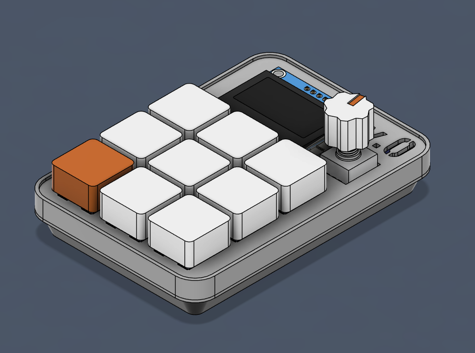

1. Souder les risers pour le RaspberryPI PICO

2. Souder l'EC11 et les resistances

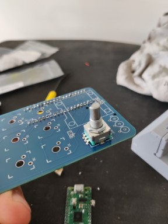
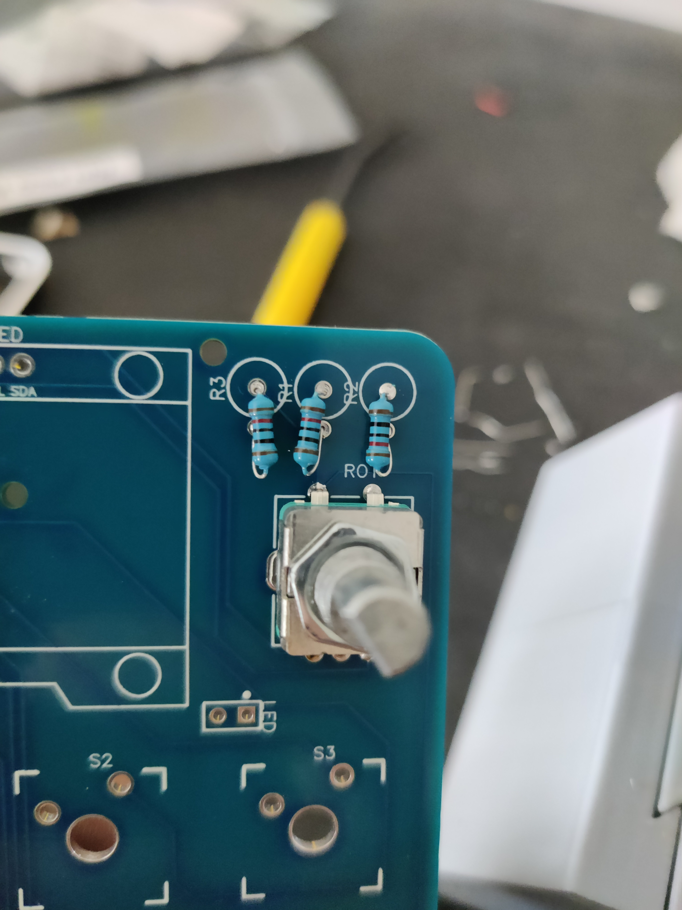

3. Clipser les switchs sur la partie haute de la case

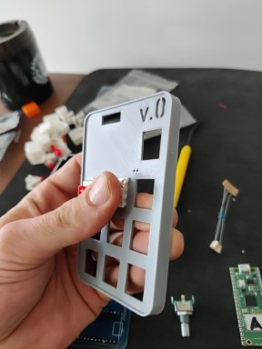
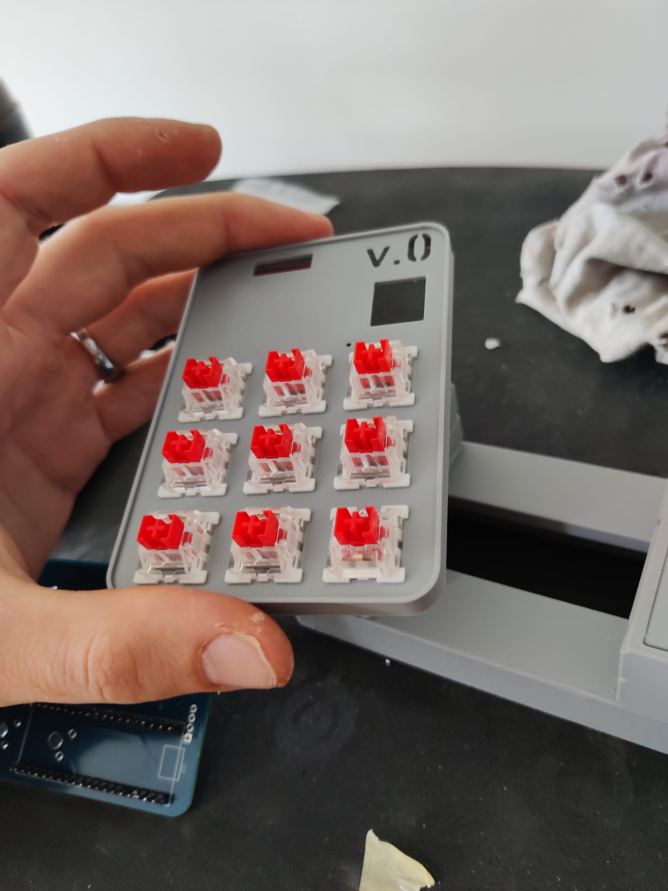

4. Placer la partie supérieur de la case et souder les switch sur le PCB

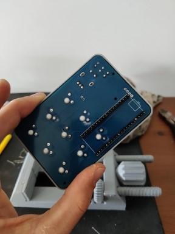

5. Souder le raspberry pico sur le PCB

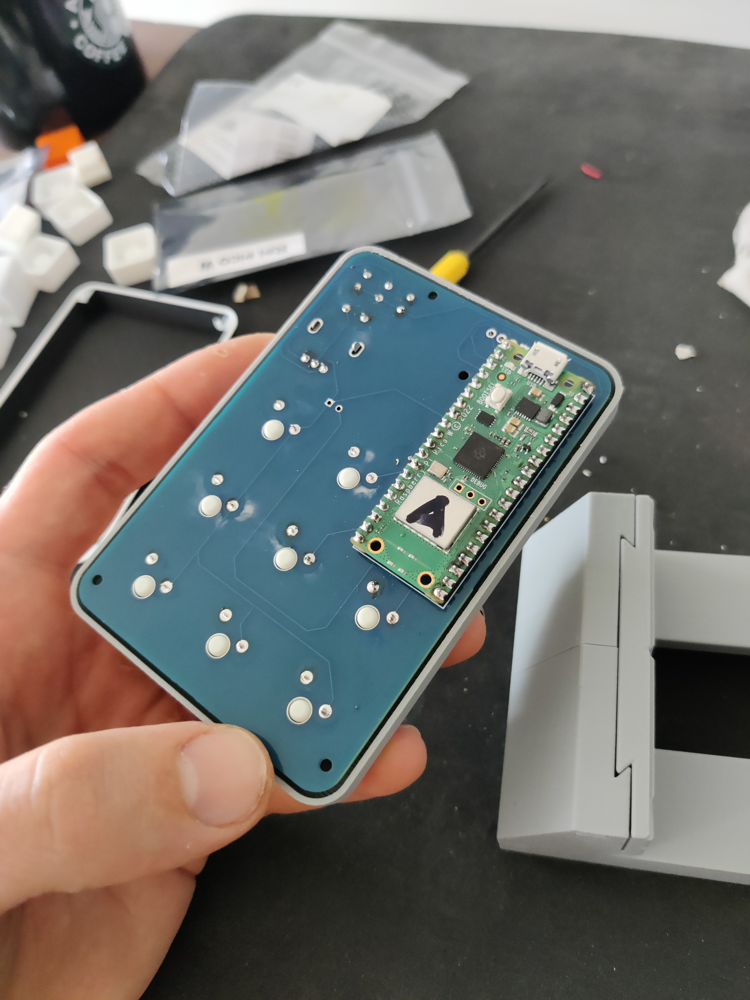

6. Souder la lampe à filament sur le PCB

7. Flasher le Raspberry pico avant de refermer la case

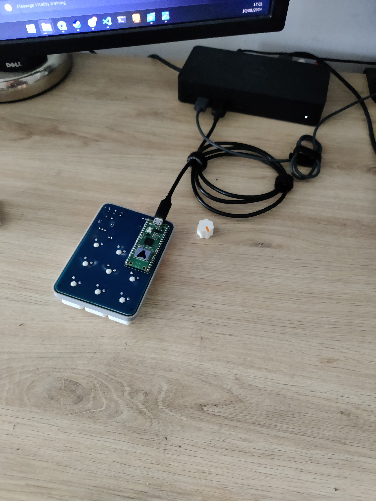

8. Refermer la case et placer les keycaps

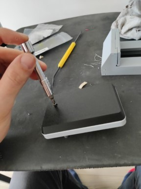
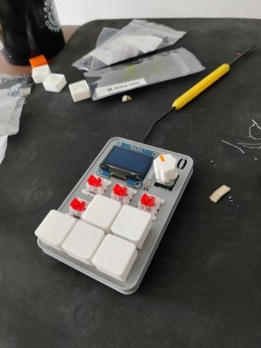

### Voilà c'est terminé ! 

## Circuit Imprimé (PCB)

Je ne vais pas rentrer trop précisément dans les détails électroniques de la confection de ce PCB car nous sommes en bas voltages et ainsi les erreures de sont pas très graves. De plus énormément de tutoriels sont présents sur internet.

Voici les deux schémas : 
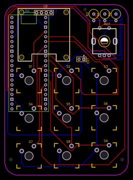
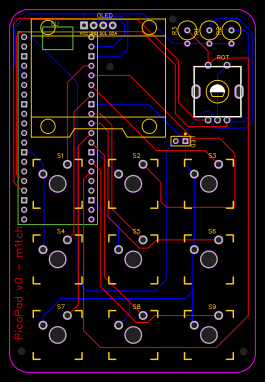

Et le schéma fonctionnel : 

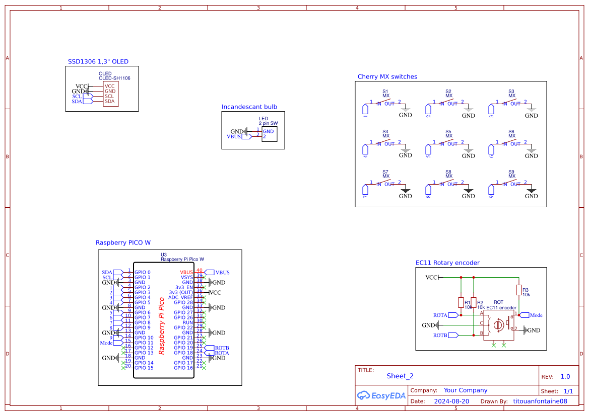

> Pour toute question vous pouvez me contacter à l'adresse titouanfontaine@hackmedaddy.fr