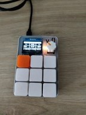
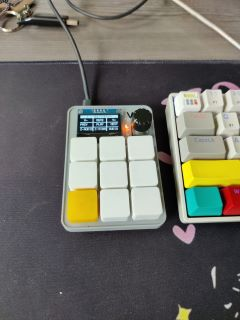

# PicoPad 
with <3 by m1tch




Ce projet combine un microcontrôleur utilisant **CircuitPython** avec **AutoHotkey** pour contrôler des fonctionnalités multimédia ou envoyer des émojis à l’aide de boutons physiques. En connectant plusieurs boutons à un microcontrôleur, chaque bouton peut déclencher une action, comme changer le volume, contrôler la lecture de médias ou envoyer des raccourcis clavier. Le script **AutoHotkey** intercepte ces raccourcis pour exécuter des commandes précises, comme envoyer des émojis dans vos applications.

### Matériel requis

- Un microcontrôleur compatible **CircuitPython** (Raspberry Pi Pico, Adafruit Feather, etc.).
- Des boutons physiques pour déclencher les actions.
- Un écran OLED optionnel pour afficher les pages d’actions.
- **AutoHotkey** installé sur l'ordinateur pour interpréter les combinaisons de touches envoyées.

---

### 1. Fonctionnement du script CircuitPython

Le script CircuitPython est conçu pour :

1. **Détecter les boutons pressés** : Le script lit l'état des boutons connectés aux broches GPIO du microcontrôleur.
2. **Envoyer des raccourcis clavier** : Le microcontrôleur se comporte comme un clavier HID, envoyant des combinaisons de touches spécifiées.
3. **Basculer entre plusieurs pages d'actions** : Les boutons peuvent avoir plusieurs fonctions selon la page active, contrôlées par un encodeur rotatif.
4. **Afficher les pages sur un écran OLED** : Le microcontrôleur affiche les actions disponibles sur un écran OLED.

#### a. Initialisation des composants matériels

Les boutons, l'écran OLED et l'encodeur rotatif sont configurés dès le démarrage du script. Les boutons sont associés à des broches GPIO, tandis que l'écran OLED affiche l'état actuel (la page active et les actions disponibles).

```python
# Initialisation des boutons sur GPIO
pins = [board.GP2, board.GP3, board.GP4, board.GP5, board.GP6, board.GP7, board.GP8, board.GP9, board.GP10]
switches = [DigitalInOut(pin) for pin in pins]
for switch in switches:
    switch.direction = Direction.INPUT
    switch.pull = Pull.UP

# Initialisation de l'encodeur rotatif
encoder = rotaryio.IncrementalEncoder(board.GP18, board.GP19)
```

#### b. Gestion des pages et des actions

Le script gère plusieurs pages, chaque page étant associée à un ensemble d'actions. Par exemple, la **page multimédia** permet de contrôler le volume et la lecture, tandis qu'une autre page pourrait envoyer des raccourcis clavier spécifiques.

Les actions sont définies dans des structures comme celle-ci :

```python
page_1 = [
    [[ConsumerControlCode.VOLUME_DECREMENT], "V-", MEDIA],
    [[ConsumerControlCode.MUTE], "MUTE", MEDIA],
    [[ConsumerControlCode.VOLUME_INCREMENT], "V+", MEDIA],
    [[ConsumerControlCode.SCAN_PREVIOUS_TRACK], "PREV", MEDIA],
    [[ConsumerControlCode.PLAY_PAUSE], "PLAY", MEDIA],
    [[ConsumerControlCode.SCAN_NEXT_TRACK], "NEXT", MEDIA],
    [[Keycode.COMMAND, Keycode.LEFT_SHIFT, Keycode.A], "Z-AUDIO", KEY],
    [[Keycode.COMMAND, Keycode.LEFT_SHIFT, Keycode.V], "Z-VIDEO", KEY],
    [[Keycode.RIGHT_GUI, Keycode.RIGHT_SHIFT, Keycode.F13], "AUDIO", KEY]
]
```

Chaque action est associée à un bouton et peut être de trois types :
- **MEDIA** : Contrôles multimédia comme le volume ou la lecture.
- **KEY** : Raccourcis clavier envoyés à l'ordinateur.
- **STRING** : Texte ou émojis envoyés sous forme de chaîne.

#### c. Gestion de l’écran OLED

L'écran OLED affiche les actions disponibles pour chaque page sous forme de grille. Lorsque vous tournez l'encodeur rotatif, le script change la page active et met à jour l'affichage pour refléter les nouvelles actions.

```python
def boot_display():
    clear_screen()
    # Afficher les actions de la page active
    splash.append(ajouter_texte(page_names[current_page], 3, 20))
    splash.append(ajouter_texte(pages[current_page][0], 3, 37))
    display.root_group = splash
```

#### d. Envoi des commandes HID

Lorsqu’un bouton est pressé, le microcontrôleur envoie la commande associée en utilisant HID (Human Interface Device). Les commandes peuvent être des contrôles multimédia ou des raccourcis clavier.

```python
if keymap[button][0] == MEDIA:
    cc.send(keymap[button][1][0])  # Envoi des commandes multimédia
elif keymap[button][0] == KEY:
    kbd.press(*keymap[button][1])  # Envoi des raccourcis clavier
elif keymap[button][0] == STRING:
    layout.write("😎")  # Envoyer un émoji ou texte
```

---

### 2. Interface avec AutoHotkey

**AutoHotkey (AHK)** est utilisé pour interpréter les raccourcis clavier envoyés par le microcontrôleur. Vous pouvez utiliser AHK pour déclencher l’envoi d’émojis ou d’autres commandes en réponse à des combinaisons de touches spécifiques.

#### a. Installation d'AutoHotkey

1. Téléchargez **AutoHotkey v2** depuis [le site officiel](https://www.autohotkey.com/).
2. Créez un nouveau script AHK pour capturer les raccourcis envoyés par le microcontrôleur.
3. Vous pouvez placer un raccourci vers votre fichier AHK dans le repertoire suivant (sous windows) pour qu'il s'execute automatiquement au démarrage : `C:\Users\<user>\AppData\Roaming\Microsoft\Windows\Start Menu\Programs\Startup`

#### b. Exemple de script AutoHotkey

Le script suivant écoute les combinaisons `Ctrl + Shift + E` envoyées par le microcontrôleur et envoie des émojis à l'emplacement du curseur.

```ahk
^+e:: ; Ctrl + Shift + E
    Send "😀"  ; Envoie un smiley
return

^+v:: ; Ctrl + Shift + V
    Send "🎥"  ; Envoie un émoji caméra
return

^+a:: ; Ctrl + Shift + A
    Send "🎧"  ; Envoie un émoji casque
return
```

Dans cet exemple :
- `^+e` intercepte `Ctrl + Shift + E`.
- `Send "😀"` envoie l'émoji dans l'application active.

Vous pouvez étendre ce script en ajoutant plus de combinaisons de touches pour contrôler des actions ou insérer du texte.

---

### 3. Comment tout fonctionne ensemble

1. **Appui sur un bouton** : Vous appuyez sur un bouton physique relié au microcontrôleur.
2. **Le microcontrôleur envoie une commande HID** : Le script CircuitPython interprète l’appui et envoie une commande (comme `Ctrl + Shift + E`).
3. **AutoHotkey interprète la commande** : AHK capte la combinaison de touches et exécute une action prédéfinie, comme l'envoi d'un émoji ou d'un texte.
4. **Affichage sur l'écran OLED** : L'écran affiche les actions disponibles pour chaque page.

---

### Conclusion

Ce projet est un excellent exemple d'intégration entre un microcontrôleur programmable avec **CircuitPython** et l’automatisation sur PC avec **AutoHotkey**. Vous pouvez facilement personnaliser les actions des boutons pour contrôler des fonctionnalités multimédia, envoyer des émojis ou exécuter d'autres actions dans vos applications.

Le microcontrôleur se comporte comme un clavier HID, et AutoHotkey sert de pont pour interpréter ces commandes de manière flexible. Vous pouvez étendre ce projet en ajoutant des pages supplémentaires, des commandes complexes, ou en affichant des informations plus avancées sur l’écran OLED.